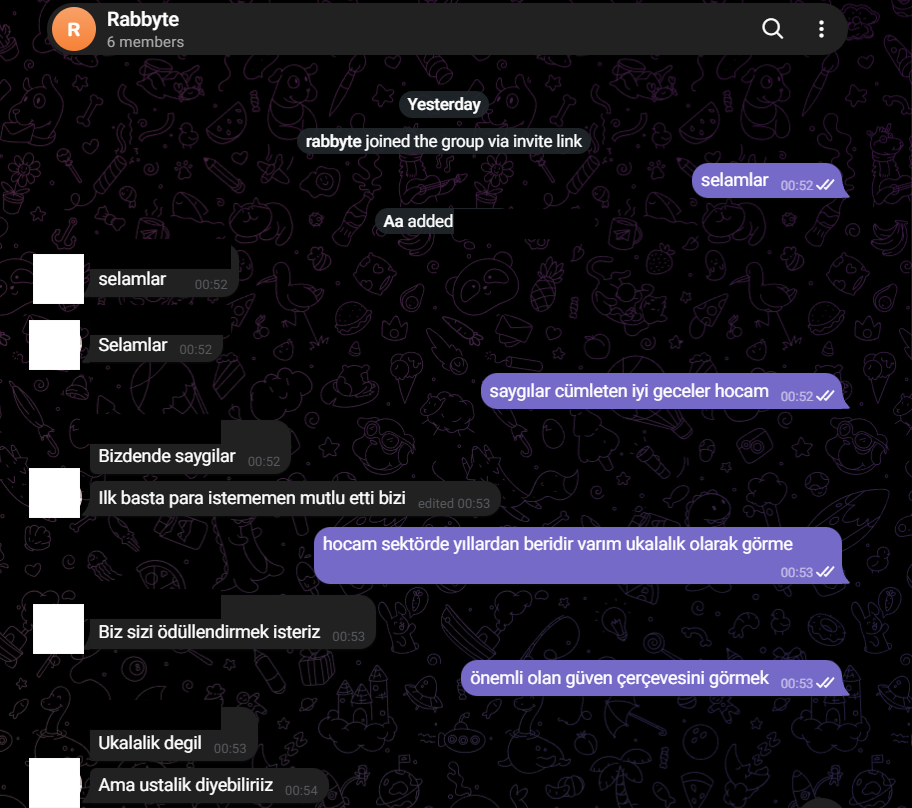

# Security Research Portfolio

This portfolio documents vulnerabilities and security weaknesses I personally identified, validated, and documented during authorized assessments of real-world web applications and APIs.

The public versions are intentionally sanitized to remove target-specific secrets, credentials, user data, and reusable exploitation details.

## Selected Case Studies

- [WebSocket Credential Exposure](case-studies/websocket-credential-exposure.md)
- [AVIF / Next.js Security Validation](case-studies/avif-security-validation.md)
- [Account Recovery Bypass](case-studies/account-recovery-bypass.md)
- [Cross-Tenant Authentication](case-studies/cross-tenant-authentication.md)

## Supporting Evidence

Each case study is accompanied by a sanitized technical validation record where appropriate.

Available evidence:

- [Redacted WebSocket Validation Evidence](evidence/websocket-validation-redacted.md)
- [Redacted AVIF Validation Evidence](evidence/avif-validation-redacted.md)
- [Redacted Account Recovery Validation Evidence](evidence/account-recovery-validation-redacted.md)
- [Redacted Cross-Tenant Validation Evidence](evidence/cross-tenant-validation-redacted.md)

These evidence files preserve observed HTTP behavior, negative controls, authentication state transitions, revalidation results, and impact boundaries while intentionally removing target-specific operational details.

## Independent Acknowledgement

A redacted screenshot from a private conversation related to the security research is included as supporting context:

Names, avatars, group identifiers, and identifying details have been removed.

This screenshot is included only as supporting context for the existence of a real-world research interaction.

It is **not** presented as:

- technical proof of a vulnerability;
- formal vendor acceptance;
- a public disclosure record;
- evidence of bounty payment;
- proof that a remediation occurred because of my research.

Technical conclusions are supported separately by the case studies and redacted validation evidence.

## Sample Report

- [Sanitized Penetration Test Report](sample-pentest-report.md)

## Research Focus

- Web application penetration testing
- API security
- Authentication and authorization
- Access control and privilege boundaries
- Account recovery and identity flows
- JWT and session security
- Multi-tenant isolation
- WebSocket security
- Vulnerability validation
- Remediation and revalidation

## Methodology

My workflow is based on reproducible evidence rather than scanner-only findings.

Typical process:

1. Define scope and safety boundaries
2. Establish a baseline or negative control
3. Map relevant application and API behavior
4. Investigate anomalous behavior
5. Reproduce suspected security weaknesses
6. Validate impact using authorized synthetic accounts or test data
7. Separate confirmed behavior from theoretical exploitability
8. Restore modified test state where applicable
9. Document remediation guidance
10. Revalidate findings when possible

## Evidence Standards

I distinguish between:

- observed behavior;
- confirmed security impact;
- conditional impact;
- theoretical exploitability;
- historical findings that are no longer reproducible.

Where a higher-impact condition cannot be safely demonstrated, it is documented as unconfirmed rather than presented as proven.

Negative controls and later revalidation are preserved where available.

## Evidence Handling

Public case studies and evidence records are intentionally sanitized.

The following are excluded where applicable:

- target domains and URLs
- credentials
- session tokens
- cookies
- verification values
- passwords
- real user information
- exact exploit inputs
- sensitive endpoint details
- private tenant identifiers
- reusable attack material

This allows technical methodology and validation logic to be reviewed without exposing target-specific secrets or operational details.

## Responsible Testing

All published case studies are based on systems I was explicitly authorized to assess.

Testing documented in this portfolio avoids unnecessary impact and does not include destructive testing, denial-of-service activity, persistence, or unauthorized access to real-user data.

Where synthetic accounts were available, they were used to validate security behavior without involving real customer accounts.

## Public Portfolio Scope

This repository is not intended to publish complete exploit chains.

Its purpose is to demonstrate:

- vulnerability discovery
- hypothesis formation
- controlled validation
- use of negative controls
- impact calibration
- evidence handling
- remediation reasoning
- revalidation discipline

Sensitive reproduction details are intentionally withheld from the public versions.

## Tests

The project includes a small unit-test suite covering JWT segment decoding and basic claim handling.

Run the tests with:

    python -m unittest discover -s tests -v

Expected result:

    Ran 4 tests

    OK

The tests currently cover:

- Base64URL decoding
- JSON payload decoding
- invalid segment rejection
- audience and tenant claim handling
